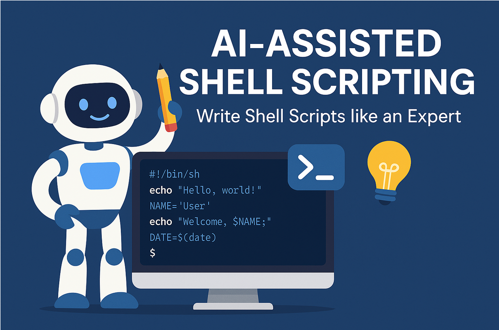

# AI Assisted Shell Scripting | Creating AWS Resources using Bash scripts
 



This project leverages AI to assist in the creation and execution of shell scripts, enhancing productivity and reducing errors.

## Features

- AI-powered script generation
- Error detection and correction
- Automated script execution
- Customizable script templates

## Prerequisites

- Python 3.x
- OpenAI API key
- Shell environment (e.g., Bash, Zsh)

## Installation

1. Clone the repository:
    ```sh
    git clone https://github.com/yourusername/ai-assisted-shell-scripting.git
    cd ai-assisted-shell-scripting
    ```

2. Install the required Python packages:
    ```sh
    pip install -r requirements.txt
    ```

3. Set up your OpenAI API key:
    ```sh
    export OPENAI_API_KEY='your-api-key'
    ```

## Usage

1. Generate a shell script using AI:
    ```sh
    python generate_script.py "Describe the task you want to automate"
    ```

2. Review and edit the generated script if necessary:
    ```sh
    nano generated_script.sh
    ```

3. Execute the script:
    ```sh
    bash generated_script.sh
    ```

## Contributing

Contributions are welcome! Please submit a pull request or open an issue to discuss your ideas.

## License

This project is licensed under the MIT License. See the [LICENSE](LICENSE) file for details.

## Contact

For any questions or suggestions, please contact [your-email@example.com](mailto:your-email@example.com).
