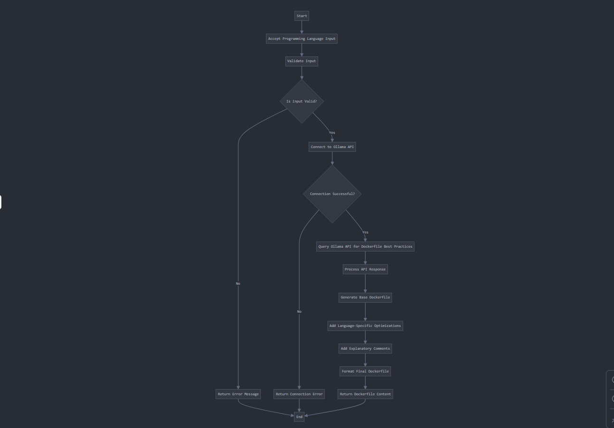

# AI Assisted DevOps: Day 2 Gen-AI for DevOps Engineers

## Project: Automating Dockerfile creation Using  Gen-AI Model

Creating Dockerfiles is a routine task that is done by Cloud and DevOps engineers. AI shines in the area. This project automates the creation/generation of Dockerfiles for various programming language by using a python script together with  Gen-AI model.  

The python script takes as input a programming language  (e.g., Python, Node.js, Java) then Connects to the Ollama API running locally and generates an optimized Dockerfile with best practices for the specified programming language.  Returns the Dockerfile content with explanatory comments

## Automated Dockerfile Generation Workflow


## Installing Ollama locally
- 1.To install Ollama locally visit the official page , [Ollama Download Page](https://ollama.com/download) and dwonload Ollama for your prefered OS 

- 2. Install Ollama for your prefered OS
**Linux**
```bash
    curl -fsSL https://ollama.com/install.sh | sh
```

**Windows**
[Download](https://ollama.com/download/windows) and run the .exe and follow the steps to install Ollama

**MacOs**
[Download](https://ollama.com/download/mac) and run the .exe and follow the steps to install Ollama or use brew

```bash
    # For MacOS
brew install ollama
```

- 3. Start Ollama Service
```bash
    ollama serve
```
- 4. Pull LLMS 
```bash
    ollama pull deepseek-coder-v2
```
## Some  Ollama CLI Commands for your daily use

| Command                  | Description                                                              |
|--------------------------|--------------------------------------------------------------------------|
| `ollama serve`           | Starts Ollama on your local system.                                      |
| `ollama create <model>`  | Creates a new model from an existing one for customization or training.  |
| `ollama show <model>`    | Displays details about a specific model, such as config and release date.|
| `ollama run <model>`     | Runs the specified model, making it ready for interaction.               |
| `ollama pull <model>`    | Downloads the specified model to your system.                            |
| `ollama list`            | Lists all the downloaded models.                                         |
| `ollama ps`              | Shows the currently running models.                                      |
| `ollama stop <model>`    | Stops the specified running model.                                       |
| `ollama rm <model>`      | Removes the specified model from your system.                            |
|--------------------------|--------------------------------------------------------------------------| 

## 🚀 Project Setup/Configuation

- 1. Create Virtual Environment

```bash
python3 -m venv venv
source venv/bin/activate  # On Linux/MacOS
# or
.\venv\Scripts\activate  # On Windows
```


- 2. Install Dependencies

```bash
pip3 install -r requirements.txt
```


- 3. Run the Application
```bash
# macOS/Linux
python3 generate_dockerfile.py

# Windows (Command Prompt)
python generate_dockerfile.py

# Windows (universal)
py generate_dockerfile.py

```
