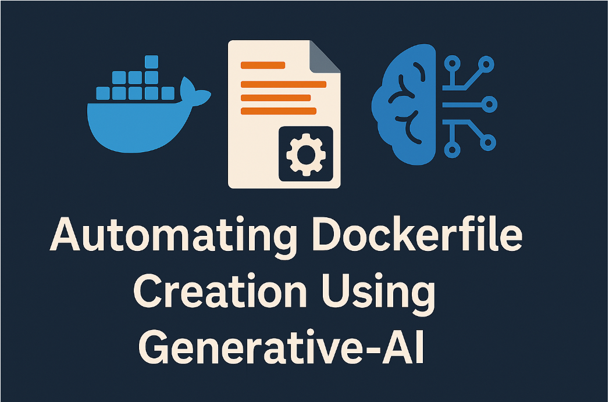

# AI Assisted DevOps: Day 3 Gen-AI for DevOps Engineers



## Project: Automating Dockerfile creation Using  Gen-AI Model
Creating Dockerfiles is a routine task that is done by Cloud and DevOps engineers. AI shines in this area. This project automates the creation/generation of Dockerfiles for various programming language by using a python script together with a  Gen-AI model.  

The python script takes as input a programming language  (e.g., Python, Node.js, Java) then Connects to the Ollama API running locally and generates an optimized Dockerfile with best practices for the specified programming language.  Returns the Dockerfile content with explanatory comments

## Automated Dockerfile Generation Workflow


## Prerequisites

### 1. Install Python: 
You should install python on your computer. to install python use the official [Download](https://www.python.org/downloads/) and install python for your prefered OS.

### 2. Installing Ollama locally
**Step 1** To install Ollama locally visit the official page , [Ollama Download Page](https://ollama.com/download) and dwonload Ollama for your prefered OS 


**Step 2** Install Ollama for your prefered OS
**Linux**
```bash
    curl -fsSL https://ollama.com/install.sh | sh
```

**Windows**
[Download](https://ollama.com/download/windows) and run the .exe and follow the steps to install Ollama

**MacOs**
[Download](https://ollama.com/download/mac)  and follow the steps to install Ollama or you can use brew

```bash
    # For MacOS
brew install ollama
```

**Step 3** Start Ollama Service
```bash
    ollama serve
```
**Step 4** Pull LLMS 

```bash
    ollama pull deepseek-coder-v2
```
### Some  Ollama CLI Commands for your daily use

Usage:
  ollama [flags]
  ollama [command]

Available Commands:

| Command                  | Description                                                              |
|--------------------------|--------------------------------------------------------------------------|
| `ollama serve`           | Starts Ollama on your local system.                                      |
| `ollama create <model>`  | Creates a new model from an existing one for customization or training.  |
| `ollama show <model>`    | Displays details about a specific model, such as config and release date.|
| `ollama run <model>`     | Runs the specified model, making it ready for interaction.               |
| `ollama pull <model>`    | Downloads the specified model to your system.                            |
| `ollama list`            | Lists all the downloaded models.                                         |
| `ollama ps`              | Shows the currently running models.                                      |
| `ollama stop <model>`    | Stops the specified running model.                                       |
| `ollama rm <model>`      | Removes the specified model from your system.                            |
| `ollama help `           | Help about any command                                                   | 
| `ollama  cp  <model>`    | Copy a model                                                             | 
| `ollama push <model>`    | Copy a model   Push a model to a registry                                |  


Flags:
  -h, --help      help for ollama
  -v, --version   Show version information

## 🚀 Project Setup/Configuation

**Step 1** Create Virtual Environment

```bash
python3 -m venv venv
source venv/bin/activate  # On Linux/MacOS
# or
.\venv\Scripts\activate  # On Windows
```


**Step 2** Install Dependencies

```bash
pip3 install -r requirements.txt
```


**Step 3** Run the Application
```bash
# macOS/Linux
python3 generate_dockerfile.py

# Windows (Command Prompt)
python generate_dockerfile.py

# Windows (universal)
py generate_dockerfile.py

```
## 🏆 ERRORS and Troubleshooting

### 429 You exceeded your current quota, please check your plan and billing details
**ERROR**
```bash
 Error generating Dockerfile: 429 You exceeded your current quota, please check your plan and billing details. For more information on this error, head to: https://ai.google.dev/gemini-api/docs/rate-limits. [violations {
}
violations {
}
violations {
}
, links {
  description: "Learn more about Gemini API quotas"
  url: "https://ai.google.dev/gemini-api/docs/rate-limits"
}
, retry_delay {
  seconds: 50
}
]
```
**Solution**
```bash
Wait for the retry delay (50 seconds as indicated in the error)
Check your API quota and billing details in your Google Cloud Console or AI Studio account
Consider upgrading your plan if you need higher rate limits
```

### Error generating Dockerfile: model "llama3.1:8b" not found, try pulling it first (status code: 404)

```bash
  Error generating Dockerfile: model "llama3.1:8b" not found, try pulling it first (status code: 404)
```
```bash
Install Ollama from https://ollama.ai
Then run the pull command above
  OR
Use a different model that's already installed:
```