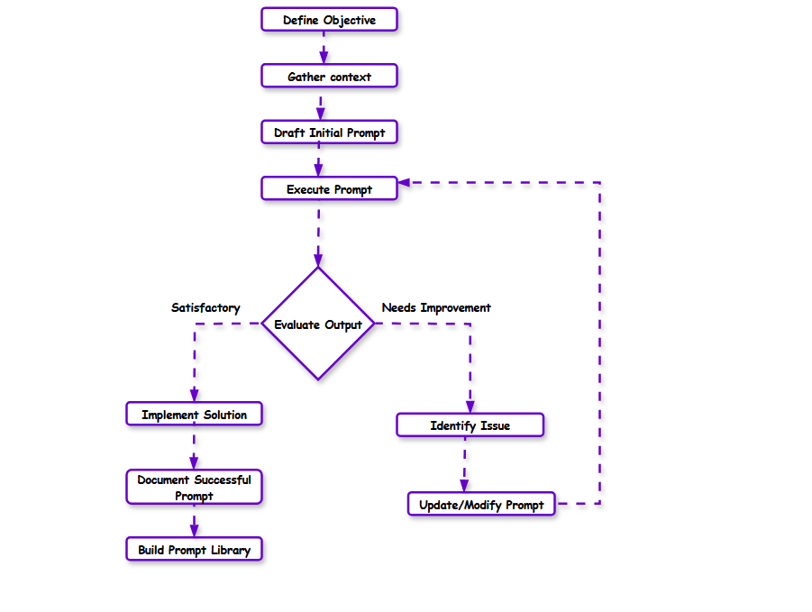

# AI Assisted DevOps: Day 2 , Prompt Engineering


## What is Prompt Engineering?
In a nutshell, Prompt Engineering (PE) can be described as the technique of crafting natural language text to guide Generative AI to generate a desired output. Gen-AI tries to mimic humans, but it still requires very detailed instructions to produce high-quality and desired outputs. Prompt Engineering is an essential skill that everyone should have when it comes to Generative AI. The  quality of your prompt (Input) to a Gen-AI determines your quality of your desired output. 

## Prompt Engineering workflow. 



To craft a good prompt , above is the workflow one can use as a guide:
- **1. Define your Objective:** You should clearly identify what you want to achieve with Gen-AI. A well define objective or goal will help you to craft a good prompt.   
- **2. Gather Context:** Collect some relevant information about your environment, requirements, and constraints that will help in crafting a good prompt. 
- **3. Draft Initial Prompt:** Create your first version of the prompt
- **4. Execute Prompt:** Submit/Execute your  prompt to the Gen-AI system
- **5. Evaluate Output:** Assess whether the result meets your needs and can accomplish your objective. If the output is satisfactory, implement the solution ,document the prompt and build a prompt library. 
For unsatisfactory outputs identify the problem which can be due to:
   - 1 Lack of Context (Add Relevant Details)
   - 2 Wrong Format (Specify Output Format)
   - 3 Inaccurate Results (Add Constraints/Examples)
   - 4 Too General (Add more  Specificity)
update your prompt and execute again. 


## why Prompt Engineering important to DevOps Engineers?
Prompt enginerring can help DevOps engineers some 
- ✅. Generate optimized CI/CD scripts (Jenkins, GitHub Actions, GitLab CI).
- ✅. Automate Kubernetes, Terraform, and Ansible configurations.
- ✅. Assist in troubleshooting and debugging.
- ✅. Generate custom Bash, Python, or YAML scripts.
- ✅. Improve incident response and root cause analysis.

## Prompt Engineering Techniques

### 1 Zero-Shot Prompting:
Zero-shot prompting means that the prompt used to communicate with the model does  not include any examples or demos. With  zero-shot prompt, you  instruct  the model to perform  a task without any  examples to guide it.

Example: 

**Prompt:** Generate a Shell Script to Backup Logs

**Output**
```bash
#!/bin/bash
# Configuration
LOG_DIR="/var/log"  # Directory containing log files
BACKUP_DIR="/backup/logs"  # Backup storage location
MAX_BACKUPS=5  # Number of backups to retain
TIMESTAMP=$(date +"%Y-%m-%d_%H-%M-%S")
BACKUP_FILE="$BACKUP_DIR/logs_backup_$TIMESTAMP.tar.gz"

# Create backup directory if it does not exist
mkdir -p "$BACKUP_DIR"

# Create a compressed backup of the logs
tar -czf "$BACKUP_FILE" -C "$LOG_DIR" .

# Remove old backups, keeping only the most recent $MAX_BACKUPS backups
ls -t "$BACKUP_DIR"/logs_backup_*.tar.gz | tail -n +$((MAX_BACKUPS + 1)) | xargs rm -f

# Print completion message
echo "Backup completed: $BACKUP_FILE"
```

### 2 Few-Shot Prompting
In few-shot prompting, you provide the model with some  few examples, usually 2-3 examples  to help  guide the AI in its response.
Example:

**Prompt**:
Here are some shell scripts to manage logs:

Example 1:
# Create a log file
touch /var/logs/app.log
echo "Application started" > /var/logs/app.log

Example 2:
# Archive old logs
tar -czf /backup/app_logs.tar.gz /var/logs/*

Now write a script to delete logs older than 7 days.

**OutPut**

```bash
#!/bin/bash

# Set the log directory
LOG_DIR="/var/logs"

# Find and delete log files older than 7 days
find $LOG_DIR -name "*.log" -type f -mtime +7 -exec rm {} \;

echo "Logs older than 7 days have been deleted."

# Optionally log this cleanup operation
echo "$(date): Log cleanup performed - files older than 7 days removed" >> $LOG_DIR/cleanup.log
```
### 3 Multi-Shot Prompting
Multi-shot prompting is an extension of few-shot prompting where you provide multiple examples and progressively refine the task.

**Prompt**:
Example 1:

kubectl create deployment nginx --image=nginx

Example 2:

kubectl get deployment nginx

Example 3:

kubectl describe deployment nginx

Now write a command to scale the nginx deployment to 5 replicas.

**OutPut**
```bash
    kubectl scale deployment nginx --replicas=5
```

### 4 Chain of Thought (CoT) Prompting
chain-of-thought (CoT) prompting enables complex reasoning capabilities through intermediate reasoning steps. Here, you ask the AI to detail its thought process step-by-step. This is particularly useful for complex reasoning tasks.

Example:

**Prompt**:
My shell script is failing. Here is the script:

#!/bin/bash
mkdir -p /backup
cp /var/logs/* /backup/

It shows a "permission denied" error. How can I fix it? Please explain step-by-step.

**Output**
I'll walk you through diagnosing and fixing the permission denied error step by step:

Permission Denied Causes:
The "permission denied" error typically occurs because:

The script is being run by a user without sufficient privileges
The destination or source directories have restricted permissions


Solutions to Try:

Solution 1: Run with Sudo
```bash
    sudo ./your_script.sh
```
Or prefix the commands with sudo:
```bash
    #!/bin/bash
sudo mkdir -p /backup
sudo cp /var/logs/* /backup/
```
Solution 2: Check Current User and Permissions

```bash
    # Check current user
whoami

# Check permissions of source and destination directories
ls -l /var/logs
ls -l /backup
```

Solution 3: Modify Permissions

```bash
    # Give write permissions to the backup directory
sudo chmod 777 /backup

# Or change owner of backup directory
sudo chown $(whoami):$(whoami) /backup
```
Solution 4: Use Specific User Permissions
```bash
    #!/bin/bash
# Run as root or with specific user permissions
sudo mkdir -p /backup
sudo cp /var/logs/* /backup/
```
Recommended Debugging Steps:

Verify you have root or sudo access
Check directory permissions
Ensure source files are readable
Verify destination directory exists and is writable


## Use Cases for DevOps Prompt Engineering
Here are some use cases that for AI in DevOps
- ✅ 1. Generating IaC (Infrastructure as Code)
- ✅ 2. CI/CD Pipeline Automation and Optimization
- ✅ 3. Technical Documentation
- ✅ 4. Generate custom Bash, Python, or YAML scripts
- ✅ 5. Log Analysis & Incident Response


## Best Practices for Prompt Engineering
- 1️⃣. Be clear and specific – The more specific the prompt, the better the output.
- 2️⃣. Use context – Provide background information or examples when needed.
- 3️⃣. Define the Output Format- Always specify the format you need
- 4️⃣.Iterate and refine – If the output isn’t ideal, adjust the prompt.
- 5️⃣.Use CoT for complex tasks – Step-by-step reasoning improves accuracy. 


##  Conclusion
With AI evolving, prompt engineering will play a crucial role in improving helping DevOps engineers in their day-to-day activities. Mastering effective prompting will make you a 10x DevOps engineer! 🚀


## REFERENCES
https://aws.amazon.com/what-is/prompt-engineering/
https://www.youtube.com/watch?v=jTW4QPE4ARc&list=PLdpzxOOAlwvJ_qWyuqhbHteY84O1qr72a
https://en.wikipedia.org/wiki/Prompt_engineering
https://www.promptingguide.ai/techniques